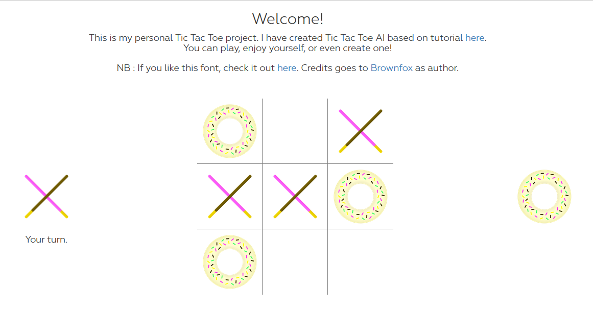

# Pocnut
### Overview
Pocnut is a web-based single-player Tic Tac Toe game with perfect AI. Pocnut's AI uses minimax technique to decide its next move by evaluating every possibilities and select a move with maximum score. Pocnut is built using ASP.NET and front-end technologies, such as JQuery, AJAX, and Bootstrap.

### Deployment
Pocnut has been deployed and now running on Microsoft Azure : [pocnut.azurewebsites.net](pocnut.azurewebsites.net).

### License
This project is licensed under MIT license.
